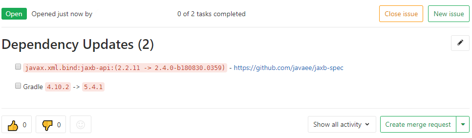

# Examples

## GitLab Notifier

A basic `build.gradle` file could look like this:

```groovy
plugins {
  id 'java-library'
  id 'org.muehlbachler.gradle.plugin.dependency-update-notifier' version "$version"
  id 'com.github.ben-manes.versions' version '0.21.0'
}

repositories {
  mavenCentral()
  jcenter()
}

dependencies {
  compile group: 'javax.xml.bind', name: 'jaxb-api', version: '2.2.11'
}

dependencyUpdates {
  outputFormatter = 'json'
}

dependencyUpdateNotifier {
  // json = 'build/dependencyUpdates/report.json'
  
  gitlab {
    url = 'https://gitlab.com/api/v4'
    projectId = 1
    token = 'private-token'
    label = 'dependency'
    title = 'Dependency Updates (%count)'
  }
}
gitlabDependencyUpdateNotifier.dependsOn dependencyUpdates
```

Replace `$version` with the latest plugin version and to run:

```
gradle gitlabDependencyUpdateNotifier
```

This results in an issue being created:


